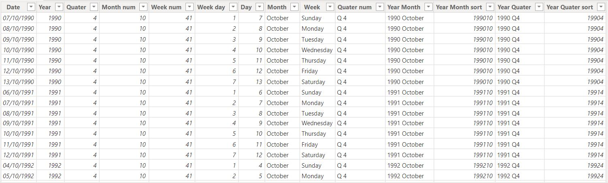

# Power-BI-Diversity-and-Inclusion-task

## INTRODUCTION

This project is about analyzing and visualizing the diversity dataset.It is a data that has to do with employment, performance and promotion of male and females across different age group and nationality in a work environment over a period of time.
## DATASET

The dataset was gotten from my PWC Australia Power BI task. On importing the data, it is seen that the data set is relatively clean, and contains relevant columns needed for further analysis.
## ANALYSIS

On previewing the dataset,I divided the task into two categories which are **EMPLOYEE** and **PERFORMANCE**, So the visualization will be on two dashboards.The following steps were carried out to get the analysis going
- CREATING A CALENDER TABLE
- CREATE MEASURES
- CREATE MEASURES WITH VARIABLES
### CREATING A CALENDER TABLE
There is need to create a calender table since we have **last hire date** column in our dataset. This table is neccessary to enable us format, and draw out more information on any data relating to date in our dataset.

        Calender = ADDCOLUMNS(CALENDAR(DATE(1990,1,1),DATE(2050,12,31))
        ,"Year",YEAR([Date])
        ,"Quater", QUARTER([Date])
        ,"Month num",MONTH([Date])
        ,"Week num", WEEKNUM([Date])
        ,"Week day", WEEKDAY([Date])
        ,"Day", DAY([Date])
        ,"Month", FORMAT([Date],"mmmm")
        ,"Week",FORMAT([Date],"dddd")
        ,"Quater num", "Q" &" "& QUARTER([date])
        ,"Year Month",YEAR([Date])&" "&FORMAT([Date],"mmmm")
        ,"Year Month sort",YEAR([date])&MONTH([date])
        ,"Year Quater", YEAR([date])&" "&"Q"&QUARTER([date])
        ,"Year Quater sort",YEAR([Date])&QUARTER([Date])
        )

The calendar table below was created

From this calendar table, is is worth noting that the **Year month sort** and **Year Quater sort** column were created to help sort the **Year month** and **Year Quater** chronologicaly and not alphabetically during visualization.

### CREATING MEASURES

The following measures were created, which will be applied on various part of the dashboards for visualization.
- Average Performance
  
          Average Performance = AVERAGE('Backing 1'[PERFORM])
  
- Average Performance Men
 
          Average Performance Men = CALCULATE([Average Performance],'Backing 1'[GENDER]="Male")
  
- Average Performance Women
  
          Average Performance Women = CALCULATE([Average Performance],'Backing 1'[GENDER]="Female")
  
- Max Performance
  
          Max Performance = CALCULATE(MAX('Backing 1'[PERFORM]))
  
- % Employee Promoted FY21
  
         % Employee Promoted FY21 = DIVIDE([Promotion Y21],COUNTROWS('Pharma Group AG'),0)
  
- % Female Promoted
  
         % Female Promoted = DIVIDE([Female promoted],[Promotion Y21],0)
 
- % Male Promoted
  
           % Male Promoted = DIVIDE([Male Promoted],[Promotion Y21],0)
  
- % Men Newly hired
  
          % New Hired Men = DIVIDE([New hired Men],[New Hire 20],0)
  
- % Women Newly hired
  
          % Women Newly hired = DIVIDE([New Hired Women],[New Hire 20],0)
  
- Female Promoted
  
          Female promoted = CALCULATE([Promotion Y21],'Pharma Group AG'[Gender]="Female")
  
- Male Promoted
  
          Male Promoted = CALCULATE([Promotion Y21],'Pharma Group AG'[Gender]="Male")
  
- Female in Pharma
  
          Female in Pharma = CALCULATE(COUNTROWS('Pharma Group AG'),FILTER('Pharma Group AG','Pharma Group AG'[Gender]="Female"))
  
- New Hired Men
  
          New hired Men = CALCULATE([New Hire 20],'Pharma Group AG'[Gender]="Male")
  
- New Hired Women
- Newly employed vs Men
- Newly employed vs Women
- Number of Employees
- Number of Newly hired
- Promoted
- Promotion vs Men
- Promotion vs Women
- Promotion Y21
- Target
- Male in Pharma
- Over target
- Under target

