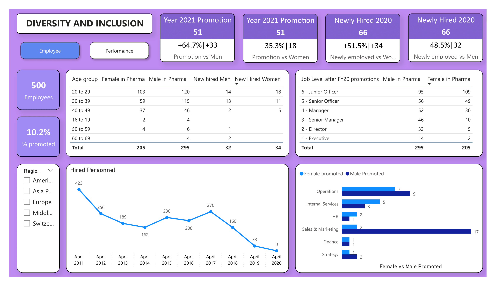
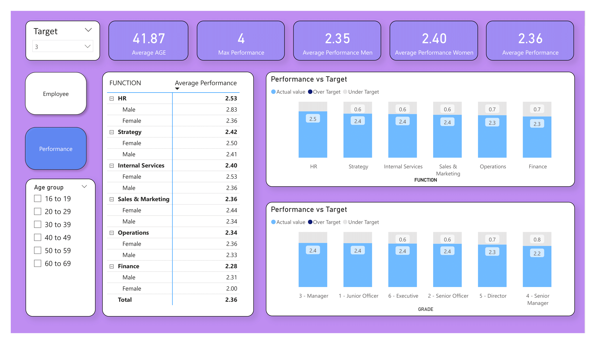

# Power-BI-Diversity-and-Inclusion-task

## INTRODUCTION

This project is about analyzing and visualizing the diversity dataset.It is a data that has to do with employment, performance and promotion of male and females across different age group and nationality in a work environment over a period of time.
## DATASET

The dataset was gotten from my PWC Australia Power BI task. On importing the data, it is seen that the data set is relatively clean, and contains relevant columns needed for further analysis.
## ANALYSIS

On previewing the dataset,I divided the task into two categories which are **EMPLOYEE** and **PERFORMANCE**, So the visualization will be on two dashboards.The following steps were carried out to get the analysis going
- CREATING A CALENDER TABLE
- CREATE MEASURES
- CREATE MEASURES WITH VARIABLES
- CREATE FORMATTED MEASURES
- TARGETS
### CREATING A CALENDER TABLE
There is need to create a calender table since we have **last hire date** column in our dataset. This table is neccessary to enable us format, and draw out more information on any data relating to date in our dataset.

        Calender = ADDCOLUMNS(CALENDAR(DATE(1990,1,1),DATE(2050,12,31))
        ,"Year",YEAR([Date])
        ,"Quater", QUARTER([Date])
        ,"Month num",MONTH([Date])
        ,"Week num", WEEKNUM([Date])
        ,"Week day", WEEKDAY([Date])
        ,"Day", DAY([Date])
        ,"Month", FORMAT([Date],"mmmm")
        ,"Week",FORMAT([Date],"dddd")
        ,"Quater num", "Q" &" "& QUARTER([date])
        ,"Year Month",YEAR([Date])&" "&FORMAT([Date],"mmmm")
        ,"Year Month sort",YEAR([date])&MONTH([date])
        ,"Year Quater", YEAR([date])&" "&"Q"&QUARTER([date])
        ,"Year Quater sort",YEAR([Date])&QUARTER([Date])
        )

The calendar table below was created

From this calendar table, is is worth noting that the **Year month sort** and **Year Quater sort** column were created to help sort the **Year month** and **Year Quater** chronologicaly and not alphabetically during visualization.

### CREATING MEASURES

The following measures were created, which will be applied on various part of the dashboards for visualization.
- Average Performance
  
          Average Performance = AVERAGE('Backing 1'[PERFORM])
  
- Average Performance Men
 
          Average Performance Men = CALCULATE([Average Performance],'Backing 1'[GENDER]="Male")
  
- Average Performance Women
  
          Average Performance Women = CALCULATE([Average Performance],'Backing 1'[GENDER]="Female")
  
- Max Performance
  
          Max Performance = CALCULATE(MAX('Backing 1'[PERFORM]))
  
- % Employee Promoted FY21
  
         % Employee Promoted FY21 = DIVIDE([Promotion Y21],COUNTROWS('Pharma Group AG'),0)
  
- % Female Promoted
  
         % Female Promoted = DIVIDE([Female promoted],[Promotion Y21],0)
 
- % Male Promoted
  
           % Male Promoted = DIVIDE([Male Promoted],[Promotion Y21],0)
  
- Number of Employees
  
          Number of Employees = COUNTROWS('Pharma Group AG')
  
- % Men Newly hired
  
          % New Hired Men = DIVIDE([New hired Men],[New Hire 20],0)
  
- % Women Newly hired
  
          % Women Newly hired = DIVIDE([New Hired Women],[New Hire 20],0)
  
- Promotion Y21
 
          Promotion Y21 = CALCULATE(COUNTROWS('Pharma Group AG'),FILTER('Pharma Group AG','Pharma Group AG'[Promotion in FY21?]="Yes"))
  
- Female Promoted
  
          Female promoted = CALCULATE([Promotion Y21],'Pharma Group AG'[Gender]="Female")
  
  - Male in Pharma
  
          Male in Pharma = CALCULATE(COUNTROWS('Pharma Group AG'),FILTER('Pharma Group AG','Pharma Group AG'[Gender]="Male"))
  
  
- Male Promoted
  
          Male Promoted = CALCULATE([Promotion Y21],'Pharma Group AG'[Gender]="Male")
  
- Female in Pharma
  
          Female in Pharma = CALCULATE(COUNTROWS('Pharma Group AG'),FILTER('Pharma Group AG','Pharma Group AG'[Gender]="Female"))
  
- Newly Hired
  
          New Hire 20 = CALCULATE(COUNTROWS('Pharma Group AG'),FILTER('Pharma Group AG','Pharma Group AG'[New hire FY20?]="Y"))
  
- New Hired Men
  
          New hired Men = CALCULATE([New Hire 20],'Pharma Group AG'[Gender]="Male")
  
- New Hired Women
  
          New Hired Women = CALCULATE([New Hire 20],'Pharma Group AG'[Gender]="Female")
  
 ### CREATING MEASURES WITH VARIABLES 
 
 The need to create measures with varaibles is to achieve the following 
 - To create visualization were we combine different measure in a card visual to set comparison in number against percentage and format our visual to add signs and colors based on certain conditions
 - To create a visualization where we set targets and compare the targets against performance

The variable measure **Newly employed vs Men** and **Newly employed vs Women** is created which will be used in the new card visual. The DAX code is seen below

- Newly employed vs Men

          Newly employed vs Men = 
          var _menemployed=[New hired Men]
          var _womenemployed=[New Hired Women]
          var _pctmenemployed=[% New Hired Men]
          var _pctwomenemployed=[% Women Newly hired]
          var _sign= IF(_menemployed>_womenemployed, "+", "")
          return
          _sign & FORMAT(_pctmenemployed,"#0.0%")&"|"&_sign & FORMAT(_menemployed,"#0,0")
  
- Newly employed vs Women
  
          Newly employed vs Women = 
          var _menemployed=[New hired Men]
          var _womenemployed=[New Hired Women]
          var _pctmenemployed=[% New Hired Men]
          var _pctwomenemployed=[% Women Newly hired]
          var _sign = IF(_womenemployed >_menemployed, "+", "")
          return
          _sign & FORMAT(_pctwomenemployed,"#0.0%")&"|"& _sign & FORMAT(_womenemployed,"#0,0")

  The variable measure **Promotion vs Men** and **Promotion vs Women** which will also be used in the new card visual.DAX code is seen below 
  
- Promotion vs Men
  
          Promotion vs Men = 
          var _men = [Promotion Y21] - [Female promoted]
          var _pctmen = [% Male Promoted]
          var _pctwomen = [% Female Promoted]
          var _sign = IF(_pctmen > _pctwomen, "+" ,"")
          return
          _sign & FORMAT(_pctmen,"#0.0%")& "|"& _sign & FORMAT(_men,"#0,#")
  
- Promotion vs Women
 
          Promotion vs Women = 
          var _women = [Promotion Y21] - [Male Promoted]
          var _pctwomen = [% Female Promoted]
          var _pctmen = [% Male Promoted]
          var _sign = IF(_pctwomen>_pctmen, "+","")
          return
          _sign & FORMAT(_pctwomen,"#0.0%") & "|" &_sign & FORMAT(_women,"#0,0")
  
### CREATING FORMATTED MEASURES

The need to create some formated measure is for use in the new card visual, where the **subtitle** value can be inputed through the **conditional formatted** field, which only recognises measures or values. Hence, some of the measures that needs to be displayed in the subtitle needs to be formatted  

- Number of Newly hired
 
          Number of newly hired = FORMAT([New Hire 20],"#0,0")&" "
  
- Promoted
  
          Promoted = FORMAT([Promotion Y21],"#,0")& " "
  

### TARGETS
Targets are used in analysis to measure performance against several metrics from a data. In this analysis, i had to set a target using the average performance as a benchmark against performance of the employees. This target value can also be adjusted when placed as a slicer. To set target value go to Modeling/New Parameter/Numeric Range. Then set the values. Further we set variable measure for **Over target** and **Under target** condition.
  
- Over target
 
          Over Target = 
          var reqperformance = [Average Performance]
          return
          IF(reqperformance>Target[Target Value],reqperformance-Target[Target Value])
  
- Under target
  
          Under Target = 
          var reqperformance = [Average Performance]
          return
          IF(reqperformance < Target[Target Value],Target[Target Value]-reqperformance)

## DASHBOARD AND VISUALIZATION
In creating my dashboard, a lot of factors were considered. As mentioned earlier, the analysis is drilled down to two dashboards. **Employee** and **Performance**.While designing the dashboard, i considered color combination, format of my visuals and positioning. The type chart,table, slicer and page navigation were also considered. The employee dashboard which contains employee details is seen below

The Perfrmance dashboard contains cards showing performance, stacked column chart of performance against target for employee based on function and employee based on grade,table and slicers. THe performance dashboard is seen below

## CONCLUSION

I was able to analyze,visualize and get insights on the following aspect from the data
- 51.5% of women were newly employed against 48.5% men
- 10.2% of the total employee were promoted
- 64.7% of men were promoted against 35.3% women
- Women had a higher average performance of 2.40 against men having 2.35
- Sales and Marketing category recorded the highest promotion, with 17 men promoted and 2 women promoted
        

